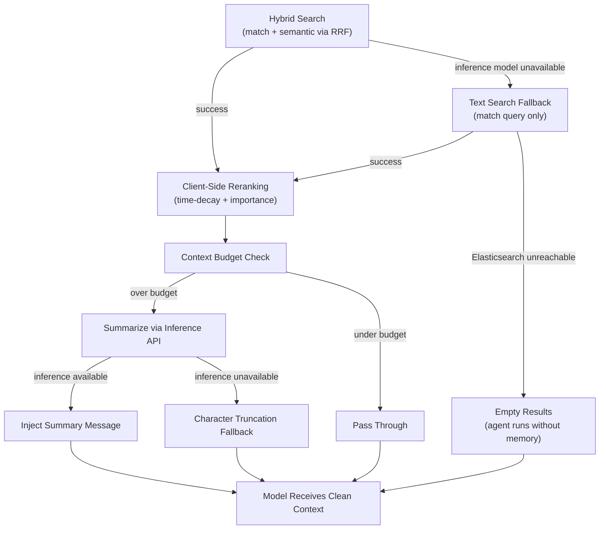

Large context windows do not solve the context problem — they amplify it. A model with a 200K token window does not mean you should stuff 200K tokens into every request. Irrelevant history wastes money, dilutes attention, and [poisons the context](https://www.elastic.co/search-labs/blog/context-poisoning-llm) with stale information that degrades response quality.

Production agents need context engineering: active management of what information reaches the model, how much of it, and how fresh it is. This post covers how [AgentEngine](/blog/building-agent-framework-part-1/) uses Elasticsearch's inference API and search capabilities to keep context windows clean, bounded, and relevant — with graceful degradation at every layer.

## The Context Budget Problem

A typical agent conversation accumulates history fast. Every user message, model response, tool call, and tool return adds tokens. After 15-20 turns with a few tool calls each, you are easily at 10K+ tokens of history — most of it irrelevant to the current task.

The standard approach is to truncate: drop messages from the beginning and keep the most recent N. This loses system prompts (which contain the agent's instructions) and discards potentially valuable context from earlier in the conversation.

AgentEngine takes a different approach with a three-zone context budget processor.

## Three-Zone History Management

The `context_budget_processor` runs before every model call as a PydanticAI history processor. It splits history into three zones:

```python
HISTORY_TOKEN_BUDGET = 2000
HISTORY_KEEP_LAST = 10
HISTORY_SUMMARY_CHAR_LIMIT = 1200

async def context_budget_processor(
    ctx: RunContext[AgentDeps],
    history: list[ModelRequest | ModelResponse],
) -> list[ModelRequest | ModelResponse]:
    """Trim or summarize history to keep within the token budget."""
    if _history_token_count(history) <= HISTORY_TOKEN_BUDGET:
        return history  # Under budget, pass through unchanged

    last_start = max(len(history) - HISTORY_KEEP_LAST, 0)

    # Always keep system prompts and the last N turns
    system_indexes = [
        i for i, msg in enumerate(history)
        if _has_system_prompt(msg) and i < last_start
    ]
    keep_indexes = set(system_indexes + list(range(last_start, len(history))))

    # Everything else gets summarized
    middle_messages = [
        msg for i, msg in enumerate(history) if i not in keep_indexes
    ]
    if not middle_messages:
        return [history[i] for i in sorted(keep_indexes)]

    # Summarize via Elasticsearch inference or truncate as fallback
    middle_text = "\n".join(_message_text(msg) for msg in middle_messages)
    summary = None
    if ctx.deps.memory:
        summary = await ctx.deps.memory.summarize_text(middle_text)
    if not summary:
        summary = middle_text[:HISTORY_SUMMARY_CHAR_LIMIT]

    summary_part = SystemPromptPart(
        content=f"Summary of earlier context: {summary}"
    )
    summary_message = ModelRequest(parts=[summary_part])

    # Reconstruct: system prompts → summary → last N turns
    new_history: list[ModelRequest | ModelResponse] = []
    for index, message in enumerate(history):
        if index in system_indexes:
            new_history.append(message)
        if index == last_start:
            new_history.append(summary_message)
        if index >= last_start:
            new_history.append(message)
    return new_history
```

The three zones:

1. **System prompts** — Always preserved regardless of position. These contain the agent's instructions and cannot be lost.
2. **Last 10 turns** — The most recent conversation context. These are the messages most likely relevant to the current task.
3. **Middle zone** — Everything between system prompts and the last 10 turns. This entire zone collapses into a single summary message.

The result is a token-bounded history that preserves instructions, keeps recent context fresh, and retains a compressed version of older interactions — all invisible to the model.

## Summarization via Elasticsearch's Inference API

The summarization step is where Elasticsearch's inference API enters the picture. When the `MemoryManager` is available, the processor calls `summarize_text()`, which uses a configured completion model through Elasticsearch's inference endpoint:

```python
async def summarize_text(self, text: str) -> str | None:
    """Summarize text using Elasticsearch inference API."""
    try:
        response = await self._client.inference.inference(
            inference_id=settings.completion_inference_id,
            input=f"Summarize the following conversation context concisely:\n\n{text}",
        )
        return response.get("completion", [{}])[0].get("result")
    except Exception:
        return None
```

The inference endpoint is configured once in the Elasticsearch cluster — in AgentEngine's case, pointing to Gemini Flash for fast, cost-efficient summarization. The agent code never manages model connections, API keys, or retry logic for the summarization model. Elasticsearch handles it.

When the inference endpoint is unavailable, the method returns `None`, and the caller falls back to simple character truncation. This is the graceful degradation pattern that runs through the entire framework.

### Inference Endpoint Configuration

AgentEngine configures three inference endpoints, each serving a distinct role:

```
TEXT_EMBEDDING=.jina-embeddings-v3      # Dense embeddings for semantic_text
SPARSE_EMBEDDING=.elser-2-elastic       # Sparse embeddings, ELSER v2
RERANK=.jina-reranker-v3               # Reranking (configured for future use)
```

These cover the full lifecycle of a memory document:

- **At index time:** `semantic_text` fields use the embedding endpoints to automatically chunk text and generate dense or sparse vectors. No external embedding pipeline.
- **At query time:** The `semantic` query leverages these same vectors for retrieval, combined with `match` queries via [RRF](https://www.elastic.co/search-labs/blog/hybrid-search-elasticsearch) for hybrid search.
- **At context engineering time:** The completion endpoint summarizes conversation history to manage the token budget.

The [Elastic Inference Service (EIS)](https://www.elastic.co/search-labs/blog/build-ai-agents-elastic-inference-service) manages the model catalog and infrastructure. The framework only needs endpoint IDs — no GPU management, no model serving code, no separate inference service to operate.

## Temporal Decay in Memory Retrieval

Not all memories are equally valuable. A conversation turn from five minutes ago is more relevant than one from five days ago, even if both score similarly on semantic similarity. The framework encodes this with temporal decay in its client-side reranking step.

After Elasticsearch's RRF retriever returns the merged candidate set, a scoring pass adjusts each result:

```python
def _score_memory(hit, now):
    """Rerank a memory hit with time-decay and importance weighting."""
    timestamp = parse_datetime(hit["_source"]["@timestamp"])
    age_hours = (now - timestamp).total_seconds() / 3600

    # Exponential decay: half-life of 24 hours
    time_score = math.exp(-0.693 * age_hours / 24)

    # Importance boost
    importance = hit["_source"].get("importance_score", 0.0)
    importance_score = math.log1p(importance)

    return time_score * 0.7 + importance_score * 0.3
```

The temporal decay uses an exponential function with a 24-hour half-life: a memory from yesterday scores half as much as one from today, all else equal. The `importance_score` field — set at indexing time based on interaction type — provides a secondary signal that survives time decay. A high-importance memory from last week still surfaces if nothing recent is relevant.

This addresses the [temporal degradation pattern](https://www.elastic.co/search-labs/blog/context-poisoning-llm) described in Search Labs' context poisoning article, but applied to the agent's own memory rather than a RAG knowledge base. Elasticsearch's `@timestamp` field and range query support make this natural — the time-decay scoring requires only a single field that is already present in every memory document.

## `semantic_text` for Automatic Chunking

Long documents are a common challenge for embedding-based retrieval. A 2000-word tool return or a long agent response can exceed the embedding model's token limit, and a single embedding for a long document often poorly represents its individual sections.

Elasticsearch's `semantic_text` field type handles this automatically. When a document is indexed, the field:

1. **Chunks the text** into appropriately-sized segments based on the inference endpoint's token limit
2. **Generates embeddings** for each chunk via the configured inference endpoint
3. **Stores the chunks and vectors** as nested data within the field

At query time, both `match` and `semantic` queries work against the chunked representations. This means a search for "Kafka migration" will find a relevant paragraph within a long memory document, even if the rest of the document discusses unrelated topics.

The practical benefit: you do not need a separate chunking pipeline, a document splitting library, or a chunk-to-parent mapping layer. Write the full text. Elasticsearch chunks and embeds it. Query the field. Get relevant results at the chunk level.

## The Graceful Degradation Chain

A recurring pattern across the framework: every context engineering step has a fallback, and failures never block the agent.



The chain:

1. **Hybrid search** (RRF with match + semantic) → falls back to **text-only search** if the inference model is unavailable → falls back to **empty results** if Elasticsearch is unreachable
2. **Context budget processor** summarizes via **inference API** → falls back to **character truncation** if the inference endpoint is down
3. **PII redaction** runs on every history message before the model sees it, including tool returns that may contain unpredictable external data

Each fallback is independently tested. The agent always runs — with progressively less context intelligence when subsystems are degraded, but it never blocks.

This philosophy — optional subsystems degrade independently, the core request-response path has the fewest hard dependencies — is what makes the difference between a demo and a production system. An agent that cannot answer because the metrics backend is down is worse than an agent that answers without recording metrics.

## What This Enables

With these context engineering patterns in place:

- **Token costs stay bounded.** The context budget processor prevents runaway token consumption in long conversations. You set a budget, the processor enforces it.
- **Relevance improves over time.** Temporal decay naturally surfaces recent, relevant context while letting stale information fade. Combined with `importance_score`, the system automatically prioritizes what matters.
- **No external infrastructure.** Embedding generation, chunking, summarization, and hybrid search all run through Elasticsearch's inference API and `semantic_text` field type. No separate embedding service, no vector database, no summarization pipeline.
- **Failures are invisible to users.** Every layer degrades gracefully. Users never see an error because a secondary system is down — they get slightly less intelligent context management, which is always better than no response.

For the full framework architecture, see the [agent framework series](/blog/building-agent-framework-part-1/). For more on defending against context quality issues, the [Search Labs article on context poisoning](https://www.elastic.co/search-labs/blog/context-poisoning-llm) covers complementary patterns at the RAG retrieval layer. For Elasticsearch's managed model catalog powering the inference endpoints described here, see [Build task-aware agents with Elastic Inference Service](https://www.elastic.co/search-labs/blog/build-ai-agents-elastic-inference-service).
