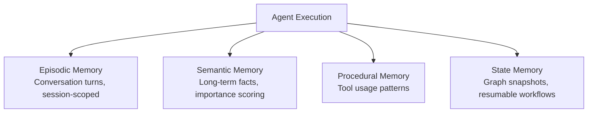
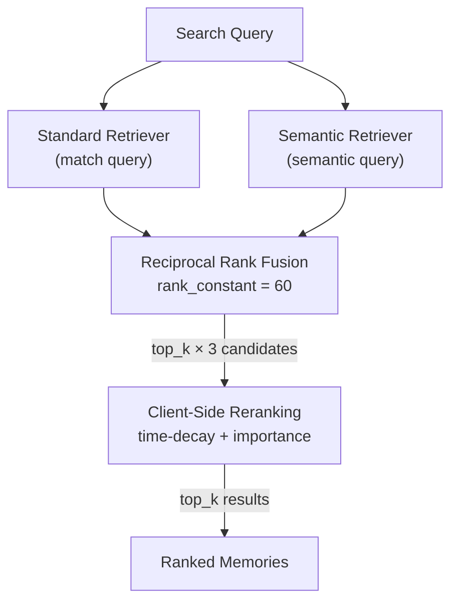

Most agent memory tutorials stop at appending messages to a list. That works for demos. In production, you need memory that spans sessions, prioritizes relevance over recency, tracks which tools worked for which tasks, and survives restarts. You need memory the agent itself can search on demand — not just context stuffed into the prompt before every call.

This post walks through a production memory system backed entirely by Elasticsearch. The framework — [AgentEngine](/blog/building-agent-framework-part-1/) — uses four distinct memory types, each stored in dedicated Elasticsearch indices, with hybrid search powering retrieval across all of them. No Redis. No Pinecone. No Postgres sidecar. One engine handles everything.

## Four Memory Types, Four Indices

Agent memory is not one thing. Different access patterns need different storage strategies. The framework models this as four dedicated indices:



**Episodic Memory** stores conversation turns scoped to a session. It is backed by a data stream with ILM for automatic retention — recent turns on fast storage, automatic compression and deletion on schedule. Every message gets indexed with metadata:

```python
document = {
    "@timestamp": now,
    "memory_id": str(uuid4()),
    "agent_id": agent_id,
    "session_id": session_id,
    "role": role,                    # "user" or "assistant"
    "content": content,
    "importance_score": 0.2,         # Default, tunable per interaction
    "source_type": source_type,      # "user_message", "agent_response", etc.
    "context_tags": {},              # Arbitrary metadata
    "causal_links": [],              # References to related memory IDs
}
```

Retrieval is either chronological (last N turns for the context window) or query-based (hybrid search for relevant past interactions).

**Semantic Memory** holds long-term facts and distilled knowledge — things the agent has learned across conversations. Each entry carries an `importance_score` that influences retrieval ranking. Over time, a consolidation process uses local embeddings to merge and deduplicate related facts.

**Procedural Memory** tracks tool usage patterns: task signature, tool chain used, outcome, and correction notes. When the agent faces a similar task, it can recall what worked — or didn't — last time. This is the agent's learning loop.

**State Memory** persists graph execution snapshots. When the agent reaches a checkpoint, the full PydanticAI graph state serializes to Elasticsearch. Users can disconnect and reconnect; the agent resumes from the exact step.

This model is similar to the [episodic/semantic/procedural taxonomy described in Search Labs](https://www.elastic.co/search-labs/blog/ai-agent-memory-management-elasticsearch), but extends it with state memory for resumable workflows and adds production-grade retrieval with post-RRF reranking.

## The MemoryManager

A single `MemoryManager` class wraps all four memory types:

```python
class MemoryManager:
    """Elastic-backed memory manager for quad-core memory."""

    def __init__(self, client: AsyncElasticsearch) -> None:
        self._client = client

    async def retrieve_episodic(self, *, agent_id, session_id=None,
                                search_query=None, top_k=10) -> list[str]:
        if search_query and search_query.strip():
            hits = await self._search_memory_index(
                index=settings.memory_episodic_index,
                agent_id=agent_id,
                search_query=search_query,
                top_k=top_k,
                session_id=session_id,
            )
        else:
            hits = await self._recent_memory_index(...)  # Chronological fallback
        return _format_conversation_lines(hits)

    async def retrieve_semantic(self, *, agent_id, search_query, top_k=5):
        hits = await self._search_memory_index(
            index=settings.memory_semantic_index,
            agent_id=agent_id,
            search_query=search_query,
            top_k=top_k,
        )
        return _hits_to_memory_items(hits)
```

Episodic retrieval has two modes. When a search query is present, it runs hybrid search to find the most relevant past turns. When no query is provided, it falls back to simple chronological fetch — the last N turns for context. Semantic retrieval always uses hybrid search, since relevance is the only access pattern that makes sense for long-term knowledge.

## Hybrid Search: RRF with Match + Semantic Queries

This is where Elasticsearch's capabilities converge. Pure vector search misses keyword-critical queries — error codes, specific tool names, exact phrases. Pure text search misses semantic similarity. You need both, and you need a way to merge results intelligently.

The retrieval method builds a hybrid query using Elasticsearch's [Reciprocal Rank Fusion (RRF)](https://www.elastic.co/search-labs/blog/hybrid-search-elasticsearch) retriever:

```python
body = {
    "size": max(top_k * 3, 10),
    "retriever": {
        "rrf": {
            "rank_constant": 60,
            "retrievers": [
                {
                    "standard": {
                        "query": {
                            "bool": {
                                "filter": [{"term": {"agent_id": agent_id}}],
                                "must": [{"match": {search_field: search_query}}],
                            }
                        }
                    }
                },
                {
                    "standard": {
                        "query": {
                            "bool": {
                                "filter": [{"term": {"agent_id": agent_id}}],
                                "must": [
                                    {
                                        "semantic": {
                                            "field": search_field,
                                            "query": search_query,
                                        }
                                    }
                                ],
                            }
                        }
                    }
                },
            ],
        }
    },
}
```



Here is what happens:

1. **Two parallel retrievers** fire against the same index. The first runs a `match` query for lexical scoring. The second runs a `semantic` query that leverages the field's vector embeddings. Both filter by `agent_id` so one agent never sees another's memories.

2. **Reciprocal Rank Fusion** merges both result lists using rank positions, not raw scores. A document that ranks high in both lists gets boosted. The `rank_constant` of 60 controls how much weight goes to lower-ranked results — higher values spread influence more evenly. Unlike convex combination, [RRF requires no score calibration](https://www.elastic.co/search-labs/blog/hybrid-search-elasticsearch), making it plug-and-play for this use case.

3. **Oversample then rerank.** The query fetches `top_k * 3` results to give the reranking step a richer candidate set. A client-side scoring pass then re-ranks using time-decay (recent memories score higher) and importance weighting (`log1p(importance_score)`), producing the final ranked list.

### Why `semantic_text` Makes This Simple

The key enabler is Elasticsearch's [`semantic_text`](https://www.elastic.co/docs/reference/elasticsearch/mapping-reference/semantic-text) field type. When you index a document, the field automatically chunks the text and generates embeddings via a configured inference endpoint — dense vectors (via Jina Embeddings v3) or learned sparse representations (via ELSER v2). You write a plain text string. Elasticsearch produces the vectors. No external embedding pipeline. No batch ETL job syncing vectors to a separate store.

The inference endpoints are configured once:

```
TEXT_EMBEDDING=.jina-embeddings-v3      # Dense embeddings
SPARSE_EMBEDDING=.elser-2-elastic       # Sparse embeddings, ELSER v2
RERANK=.jina-reranker-v3               # Configured for future reranking
```

Both the `semantic` query and `match` query target the same `semantic_text` field, giving the RRF retriever two complementary scoring strategies from one field definition. This is the same [hybrid search pattern](https://www.elastic.co/search-labs/blog/hybrid-search-elasticsearch) described in Search Labs, applied specifically to agent memory with domain-specific reranking on top.

### Graceful Degradation

If the hybrid query fails — inference model not deployed, index misconfigured — the system catches the error and falls back to a plain `match` query for text search. Memory should never block agent execution. This is a recurring pattern in the framework: optional subsystems degrade independently, and the core request-response path has the fewest hard dependencies possible.

```python
try:
    hits = await self._hybrid_search(index, agent_id, search_query, top_k)
except Exception:
    logger.warning("hybrid_search_failed", index=index, exc_info=True)
    hits = await self._text_search(index, agent_id, search_query, top_k)
```

This matters because [context poisoning](https://www.elastic.co/search-labs/blog/context-poisoning-llm) — stale or degraded information contaminating the context window — is a real failure mode in production. Falling back to text search when vector search is unavailable is better than returning nothing or blocking the agent entirely.

## The `recall_memory` Tool: Agent-Controlled Retrieval

Most agent frameworks inject memory context upfront — load recent history, stuff it into the system prompt, hope it is relevant. This wastes tokens when the injected context is not useful for the current task.

The framework takes a different approach. The agent itself can search its own memory via a dynamically registered PydanticAI tool:

```python
@agent.tool
async def recall_memory(ctx_run: RunContext[AgentDeps], query: str) -> str:
    """Recall relevant memory snippets for the current agent session."""
    deps = ctx_run.deps
    if not deps.memory or not deps.agent_id:
        return "Memory is not available."
    results = await deps.memory.search_memory(
        agent_id=deps.agent_id,
        search_query=query,
        top_k=5,
    )
    if not results:
        return "No relevant memories found."
    return "\n".join(results)
```

This gives the LLM agency over its own recall. The model decides _when_ and _what_ to search for based on the current conversation. If the user asks a question that requires historical context, the model calls `recall_memory` with a targeted query. If the current task is self-contained, it skips memory entirely.

The practical benefit: smaller context windows, fewer wasted tokens, and more relevant memory injection. The agent only loads what it needs, when it needs it.

## Putting It Together

The complete memory architecture uses Elasticsearch as a single backend for four fundamentally different data access patterns:

| Memory Type | Access Pattern | ES Feature |
|-------------|---------------|------------|
| Episodic | Chronological + hybrid search | Data streams, `semantic_text`, RRF |
| Semantic | Relevance-based hybrid search | `semantic_text`, RRF, importance scoring |
| Procedural | Task-signature matching | Structured queries, term filters |
| State | Key-value checkpoint lookup | Document CRUD by graph execution ID |

Each index uses the same `semantic_text` field type with the same inference endpoints. The `MemoryManager` provides a unified interface. Hybrid search with RRF and client-side reranking handles retrieval across episodic and semantic memory. The `recall_memory` tool gives the agent control over when to search.

The technical argument for Elasticsearch as the sole memory backend is that it handles text search, vector search, and automatic embedding generation in a single engine. Add data streams for time-series patterns and ILM for automatic retention, and you get a memory backend that covers every access pattern without stitching together separate systems.

For more on the full framework architecture — including MCP tool aggregation and SSE streaming — see the [agent framework series](/blog/building-agent-framework-part-1/). For a broader look at agent memory patterns with Elasticsearch, the [Search Labs tutorial on AI agent memory](https://www.elastic.co/search-labs/blog/ai-agent-memory-management-elasticsearch) covers document-level security and selective retrieval approaches that complement the patterns described here.
