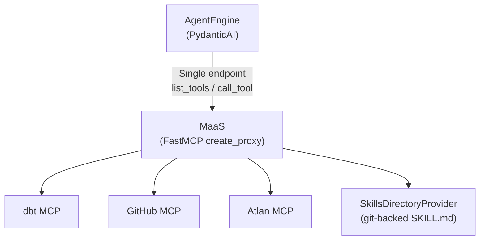
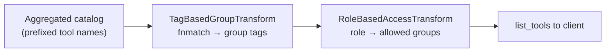
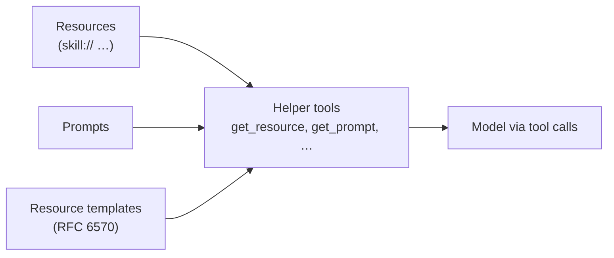

Every new upstream integration (dbt, GitHub, Atlan) means more auth logic while failure modes compound inside the process that is supposed to stay focused on reasoning. Part 1 showed how **AgentEngine** keeps that concern out of the LLM loop for memory and streaming — but tools are the other half of the story. If each AgentEngine instance opened connections to every MCP server, held API tokens, and enforced who sees what, you would duplicate policy and secrets across replicas and blur the line between orchestration and integration.

This post delivers on what [Part 1](/blog/building-agent-framework-part-1/) set up next: **MaaS (MCP as a Service)** — a FastMCP proxy that aggregates multiple remote MCP servers behind a single endpoint, keeps credential handling out of AgentEngine, and (via FastMCP’s **SkillsDirectoryProvider**) exposes a git-submodule **skills library** as MCP resources. **`TagBasedGroupTransform`** and **`RoleBasedAccessTransform`** chain on the aggregated catalog in **production**, driven by **`tool_groups.yaml`**. We sometimes turn that pipeline **off in non-prod** to exercise the full tool surface during integration testing — production keeps it **on**. Here is how `create_proxy` composes upstreams, how skills are mounted, how RBAC tagging and filtering work, and why that decomposition matters for production.

## The Problem MaaS Solves

Without MaaS, AgentEngine would need to:

1. Maintain connections to every upstream MCP server individually
2. Handle authentication for each server (different tokens, different mechanisms)
3. Implement tool filtering and access control in the agent layer
4. Manage server health, retries, and failover per connection

That is a lot of cross-cutting concern leaking into agent logic. MaaS pushes all of it into a dedicated service. AgentEngine connects to one endpoint and gets a clean, pre-filtered list of tools, prompts, and resources — the same separation of concerns Part 1 described for the two-service layout.

A request-scoped view (compare the Part 1 diagram) centers MaaS between AgentEngine and every upstream:



## FastMCP Proxy Architecture

FastMCP’s `create_proxy` accepts a configuration dictionary (the same `mcpServers` shape used elsewhere in the MCP ecosystem) and returns one MCP server that proxies tools, resources, and prompts from all upstreams — with **component prefixing** so names stay unambiguous (`dbt_*`, `github_*`, …). You can also point `create_proxy` at a single URL; multi-server configs are the aggregation pattern we use here.

```python
from fastmcp.server import create_proxy

def _build_proxy_config() -> dict[str, dict[str, dict[str, Any]]]:
    servers = dict([
        _build_server_entry(
            "dbt",
            "MCP_DBT_URL",
            "MCP_DBT_TRANSPORT",
            headers=_build_dbt_headers(),
            default_transport="streamable-http",
        ),
        _build_server_entry(
            "github",
            "MCP_GITHUB_URL",
            "MCP_GITHUB_TRANSPORT",
            headers=_build_github_headers(),
        ),
        _build_server_entry(
            "atlan",
            "MCP_ATLAN_URL",
            "MCP_ATLAN_TRANSPORT",
            headers=_build_atlan_headers(),
        ),
    ])
    return {"mcpServers": servers}

mcp = create_proxy(
    _build_proxy_config(),
    name="MCP as a Service",
)
```

Each server entry packages a URL, transport type (including **Streamable HTTP** where supported — the MCP transport that supersedes older HTTP+SSE-only patterns for many deployments), and authentication headers. The `_build_server_entry` helper keeps this declarative:

```python
def _build_server_entry(
    prefix: str,
    url_env: str,
    transport_env: str,
    *,
    headers: dict[str, str] | None = None,
    default_transport: str = "http",
) -> tuple[str, dict[str, Any]]:
    url = _require_env(url_env)
    transport = os.getenv(transport_env, default_transport)
    config: dict[str, Any] = {"url": url, "transport": transport}
    if headers:
        config["headers"] = headers
    return prefix, config
```

Adding a new upstream server is a single function call in `_build_proxy_config`. The proxy handles connection lifecycle, tool namespacing (each tool gets prefixed by its server name — `dbt_list_models`, `github_create_pull_request`), and forwarding of tool calls back to the originating server, consistent with FastMCP’s documented multi-server proxy behavior.

Authentication is isolated per server. dbt can use `DBT_TOKEN`, optional `DBT_PROD_ENV_ID` (passed as `x-dbt-prod-environment-id`), plus optional extra headers from `MCP_DBT_HEADERS_JSON`. GitHub uses `GITHUB_PAT` as a Bearer token, with optional `MCP_GITHUB_HEADERS_JSON`. Atlan uses `ATLAN_API_KEY` as `Authorization`, with optional `MCP_ATLAN_HEADERS_JSON`. None of these credentials touch AgentEngine — they live in MaaS environment variables and are merged into per-server config by the builder functions.

## Skills library: `SkillsDirectoryProvider`

Beyond proxied SaaS MCPs, MaaS registers a **skills** provider so internal playbooks ship with the server. A git submodule under `skills/skills/` holds team namespaces (`shared/`, `marketing/`, `sales/`, `it/`, …); each leaf directory is one skill with a `SKILL.md` and optional supporting files. At startup, if that tree exists, MaaS calls FastMCP’s **`SkillsDirectoryProvider`** with one root per namespace directory — the same pattern [documented for FastMCP’s skills provider](https://gofastmcp.com/servers/providers/skills) — so those Markdown trees become discoverable **MCP resources** (typically under a `skill://` URI scheme for clients that support it). No separate build step: skills are plain files, versioned with the deployment.

This gives product and platform teams a single channel to publish instructions the agent can retrieve alongside dbt/GitHub/Atlan tools, without standing up another service.

## Tool filtering with transforms

FastMCP applies **transforms** to the component catalog: they sit in the pipeline between providers and clients and can filter or enrich what `list_tools` returns. In MaaS, **`TagBasedGroupTransform`** and **`RoleBasedAccessTransform`** (in `transforms.py`, backed by **`tool_groups.yaml`**) are **registered in production** so `list_tools` reflects role-scoped visibility. In test or scratch environments we may omit them briefly to see every proxied tool without policy — the sections below describe the live behavior: first **tag**, then **filter**.



### Step 1: Tag Tools with Group Metadata

The `TagBasedGroupTransform` reads a YAML configuration file that maps tool name patterns to named groups:

```yaml
# tool_groups.yaml
groups:
  analytics:
    description: "Tools for data analysis, reporting, and insights"
    tools:
      - "dbt_*"
      - "atlan_*"
      - "github_*"
    roles:
      - "analyst"
      - "admin"

  platform_ops:
    description: "Infrastructure and platform management tools"
    tools:
      - "atlan_*"
      - "dbt_*"
      - "github_*"
    roles:
      - "devops"
      - "sre"
      - "admin"

  github_integration:
    description: "GitHub repository and pull request tools"
    tools:
      - "github_*"
      - "dbt_*"
      - "atlan_*"
    roles:
      - "analyst"
      - "devops"
      - "sre"
      - "admin"
```

The patterns use `fnmatch` syntax — standard shell-style wildcards. When a client lists tools, the transform runs each tool name against every group's patterns and attaches matching group names as metadata:

```python
class TagBasedGroupTransform(Transform):
    def _match_tool_to_groups(self, tool_name: str) -> list[str]:
        matching_groups: list[str] = []
        for group_name, group in self.tool_groups.items():
            for pattern in group.tools:
                if fnmatch.fnmatch(tool_name, pattern):
                    matching_groups.append(group_name)
                    break
        return matching_groups

    async def list_tools(self, tools: Sequence[Tool]) -> Sequence[Tool]:
        enhanced_tools: list[Tool] = []
        for tool in tools:
            matching_groups = self._match_tool_to_groups(tool.name)
            if matching_groups:
                existing_tags = set(tool.tags) if tool.tags else set()
                existing_tags.update(matching_groups)
                tool.tags = existing_tags

                if tool.meta is None:
                    tool.meta = {}
                tool.meta["groups"] = matching_groups
            enhanced_tools.append(tool)
        return enhanced_tools
```

After this step, a tool like `dbt_list_models` carries `groups: ["analytics", "platform_ops"]` in its metadata. The tool itself is unchanged — the transform only enriches it with classification data.

### Step 2: Filter by Role

The `RoleBasedAccessTransform` reads the user's role and only passes through tools whose groups match:

```python
class RoleBasedAccessTransform(Transform):
    def _get_allowed_groups(self, role: str) -> set[str]:
        if role == "agent-engine":
            return set(self.tool_groups.keys())  # Full access

        allowed: set[str] = set()
        for group_name, group in self.tool_groups.items():
            if role in group.roles:
                allowed.add(group_name)
        return allowed

    async def list_tools(self, tools: Sequence[Tool]) -> Sequence[Tool]:
        user_role = self._get_user_role()
        allowed_groups = self._get_allowed_groups(user_role)

        if user_role == "agent-engine":
            return tools  # Service account sees everything

        if not allowed_groups:
            return []  # Unknown roles see nothing

        filtered_tools: list[Tool] = []
        for tool in tools:
            tool_groups = set(tool.meta.get("groups", [])) if tool.meta else set()

            if not tool_groups:
                filtered_tools.append(tool)  # Ungrouped = system tool
                continue

            if tool_groups & allowed_groups:  # Set intersection
                filtered_tools.append(tool)

        return filtered_tools
```

The checked-in module also carries `_parse_role_from_context` for future header/JWT-based roles; until that is wired, **`USER_ROLE`** (default `guest`) stands in for integration tests. The key design decision remains: the **`agent-engine`** role bypasses all filtering so AgentEngine sees the full catalog; per-request narrowing still happens in AgentEngine (the `mcp_tools` field from Part 1). This two-layer model separates **service-level** access control (MaaS transforms) from **request-level** tool selection (AgentEngine).

Ungrouped tools — tools that don't match any pattern in `tool_groups.yaml` — are treated as system tools and always included. That keeps MaaS helper tools (`get_resource`, `get_prompt`, etc.) visible under RBAC.

## Helper tools: bridging MCP primitives

The Model Context Protocol surfaces **tools**, **resources**, **prompts**, and **resource templates** (parameterized resource URIs). Many clients only call tools first-class. MaaS bridges the gap by exposing resources, prompts, and templates as callable tools so the LLM can reach them through the same mechanism.



Helper tools use a short-lived **`MCPServerStreamableHTTP`** client pointed at **this same MaaS process** (`HOST` / `PORT`, with a request **timeout**), so they read the already-aggregated catalog — not each upstream directly. Before calling into the client, the implementation checks **`client.capabilities.resources`** / **`client.capabilities.prompts`** and fails fast with a clear error if the server did not advertise that capability.

```python
@mcp.tool()
async def get_resource(uri: str) -> str:
    """Retrieve the content of a resource by its URI."""
    client = await _get_maas_client()
    async with client:
        if not client.capabilities.resources:
            raise RuntimeError("MCP server does not advertise resource support.")
        content = await client.read_resource(uri)
        # ... normalize list vs str, wrap failures in RuntimeError ...

@mcp.tool()
async def get_prompt(name: str, arguments: dict[str, str] | None = None) -> str:
    """Retrieve a rendered prompt by name with optional arguments."""
    return await _render_prompt(name, arguments)

@mcp.tool()
async def expand_resource_template(
    name: str, arguments: dict[str, str] | None = None
) -> str:
    """Expand a resource template URI with provided argument values."""
    # list_resource_templates → validate RFC 6570 vars → _expand_uri_template

@mcp.tool()
async def expand_prompt_template(
    name: str, arguments: dict[str, str] | None = None
) -> str:
    """Expand a prompt template with provided argument values (alias to rendered prompt today)."""
    return await _render_prompt(name, arguments)
```

`_render_prompt` walks MCP prompt messages and flattens text (including resource links and non-text parts into readable placeholders) so the model always gets a string. **`expand_prompt_template`** is the fourth helper — today it delegates to the same renderer; it is there so prompt templating can diverge from resource templates later without renaming the public tool surface.

This matters because the agent's LLM can only invoke tools. By wrapping resources and prompts as tools, the agent can dynamically fetch documentation, skills-backed resources, expanded URI templates, and rendered prompts — all through one mechanism. **`expand_resource_template`** keeps RFC 6570-style parsing and validation so incomplete arguments return explicit errors.

## How AgentEngine connects

On the AgentEngine side, the outward MaaS connection uses PydanticAI’s **`MCPServerStreamableHTTP`** client — the type for MCP’s Streamable HTTP (or HTTP) transport described in the [PydanticAI MCP client docs](https://ai.pydantic.dev/mcp/client/):

```python
from pydantic_ai.mcp import MCPServerStreamableHTTP

async def get_maas_client() -> MCPServerStreamableHTTP:
    """Create an MCP client connected to MaaS."""
    return MCPServerStreamableHTTP(url=settings.maas_endpoint)
```

Use your real service URL (including path if your ingress mounts MCP under `/mcp`). Inside MaaS, the helper tools use a **separate** `MCPServerStreamableHTTP` pointed at `http://{HOST}:{PORT}` on localhost so they introspect the aggregated server — that is not the same object AgentEngine uses.

Used as an async context manager, the client handles the MCP connection lifecycle. When AgentEngine discovers available components, it asks MaaS for everything in one call:

```python
@router.get("/components", tags=["MCP Components"])
async def get_components(
    servers: str | None = Query(None, description="Comma-separated server keys"),
) -> ComponentsResponse:
    async with await get_maas_client() as maas_client:
        tools_list = await maas_client.list_tools()
        prompts_list = await list_prompts(maas_client)
        resources_list = await maas_client.list_resources()
        templates_list = await maas_client.list_resource_templates()

        # Filter by server prefix if requested
        # Transform into schema objects
        # Return ComponentsResponse with all 4 component types
```

The optional `servers` query parameter lets the frontend filter by upstream server. Asking for `?servers=dbt` returns only dbt tools, prompts, and resources. This is a UI convenience — AgentEngine uses it to show relevant tools per context, while the underlying MaaS connection (as **`agent-engine`**) still receives the full aggregated catalog from the proxy before any UI filtering.

## Runtime and transport

The MaaS process reads **`MAAS_TRANSPORT`** (or **`MCP_TRANSPORT`**) and accepts **`stdio`**, **`http`**, **`sse`**, or **`streamable-http`**, defaulting to **`http`** for local runs. Production Kubernetes manifests set **`MAAS_TRANSPORT=streamable-http`** so clients speak the Streamable HTTP profile end-to-end. **`HOST`** and **`PORT`** bind the server (defaults `127.0.0.1` / `8000` for `python server.py`, `0.0.0.0` in containers).

## Service orchestration

In deployment, MaaS and AgentEngine run as separate workloads. A minimal Compose-style sketch:

```yaml
services:
  maas:
    build: ./maas
    ports:
      - "8000:8000"
    environment:
      - MCP_DBT_URL=${MCP_DBT_URL}
      - MCP_GITHUB_URL=${MCP_GITHUB_URL}
      - MCP_ATLAN_URL=${MCP_ATLAN_URL}
      - MAAS_TRANSPORT=${MAAS_TRANSPORT:-streamable-http}
      # Auth tokens and optional MCP_*_HEADERS_JSON per server...

  agent-engine:
    build: ./agent-engine
    ports:
      - "8080:8080"
    environment:
      - MAAS_ENDPOINT=http://maas:8000/mcp
    depends_on:
      maas:
        condition: service_healthy
```

Kubernetes uses the same idea: MaaS exposes port 8000 with readiness/liveness probes; AgentEngine receives a single **`MAAS_ENDPOINT`** secret. AgentEngine should not start meaningful traffic until MaaS is ready. Credentials, transport choice, skills submodule, and upstream discovery stay encapsulated in MaaS.

## Why This Decomposition Works

Splitting tool aggregation into its own service pays off in several ways:

**Independent scaling.** MaaS is lightweight — it proxies requests and filters tools. It does not hold state. AgentEngine is compute-heavy (LLM orchestration, memory queries). They scale independently with different resource profiles.

**Credential isolation.** Upstream API tokens never touch AgentEngine. MaaS is the only service that holds third-party credentials. This reduces the blast radius of a compromised AgentEngine container.

**Tool management without redeploying AgentEngine.** Adding an upstream server or editing `tool_groups.yaml` only requires rolling MaaS; skills change when the submodule revision changes. AgentEngine picks up tool and component changes on its next `/components` call.

**Testability.** Each transform is a pure function from `Sequence[Tool]` to `Sequence[Tool]`. You can test tagging and filtering in isolation with mock tool lists. Skills are plain Markdown — reviewable in git without booting LLMs.

## What Comes Next

Part 3 will get into **production patterns**: privacy-preserving history processors that redact PII before it reaches the model, context budget management that summarizes old history to stay within token limits, and OpenTelemetry instrumentation for tracing agent executions end-to-end.
