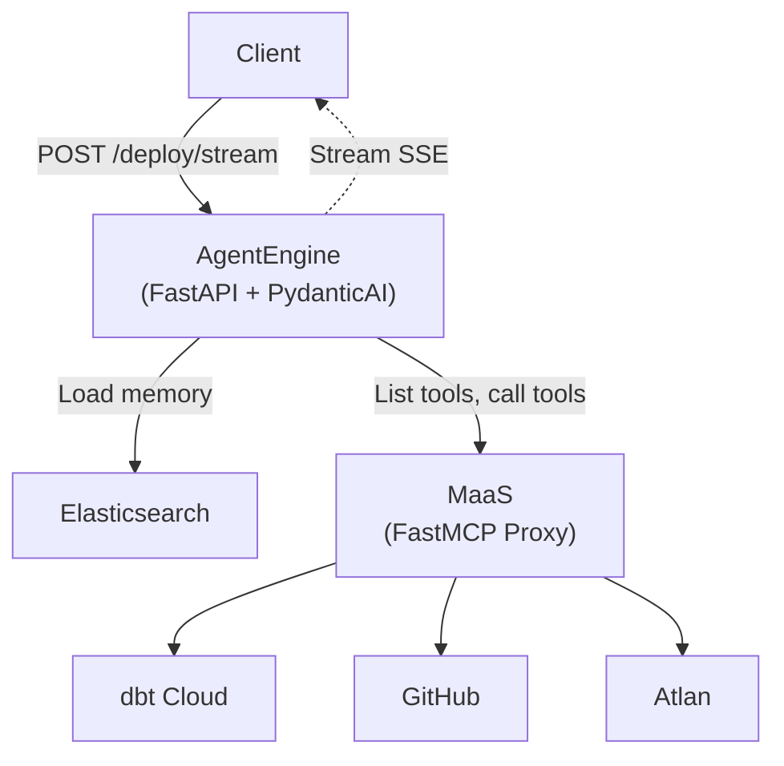
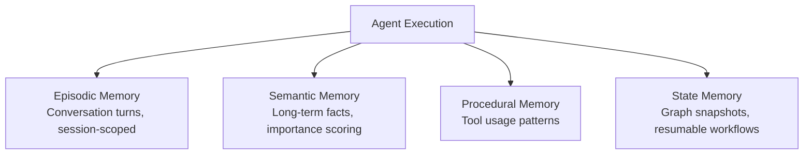
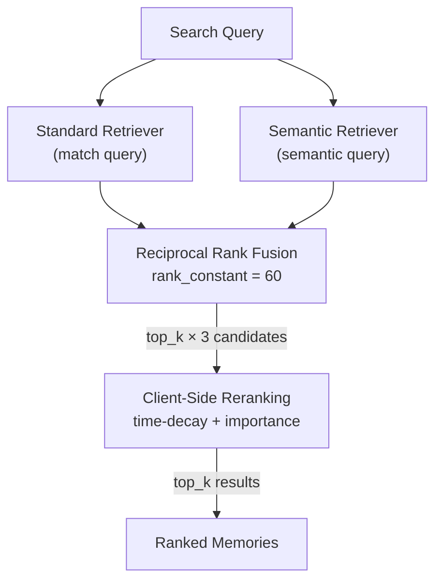

Most LLM demos end at a single prompt-response loop. Production agents need more: persistent memory across sessions, access to external tools, real-time streaming, and enough structure to debug when things go wrong.

This post is Part 1 of a series on an agent framework our team built to solve those problems. The stack is Python-native — FastAPI for the HTTP layer, PydanticAI for agent orchestration, FastMCP for tool aggregation, and Elasticsearch for the memory backbone. This first installment covers the overall architecture, then goes deep on how Elasticsearch powers a quad-core memory system with hybrid search.

## Architecture at a Glance

The framework runs as two independent services:

- **AgentEngine** — A FastAPI application that receives requests, resolves context (tools, memory, prompts), executes a PydanticAI agent, and streams results back via SSE.
- **MaaS (MCP as a Service)** — A FastMCP proxy that aggregates multiple remote MCP servers (dbt, GitHub, Atlan, etc.) behind a single endpoint with role-based access control and tool filtering.

A typical request flows like this:



Both services are stateless. Session state lives in Elasticsearch. Tool definitions come from MaaS at request time. This means the AgentEngine scales horizontally without coordination — any instance can handle any request.

### Two-Step Graph Execution

Agent execution uses PydanticAI's graph API with two discrete steps: **resolve** and **run**.

```python
g = GraphBuilder(state_type=GraphState, deps_type=GraphDeps, output_type=GraphResult)

@g.step
async def resolve_step(ctx):
    """Resolve request context and store it on graph state."""
    await _resolve_step(ctx)  # Load memory, resolve MCP tools/prompts

@g.step
async def run_step(ctx) -> GraphResult:
    """Execute the agent run with resolved dependencies."""
    return await _run_step(ctx)  # Build PydanticAI agent, stream response

g.add(
    g.edge_from(g.start_node).to(resolve_step),
    g.edge_from(resolve_step).to(run_step),
    g.edge_from(run_step).to(g.end_node),
)
```

The resolve step handles expensive I/O — fetching MCP tool lists, loading memory context, resolving prompt templates — before the LLM ever sees a token. The run step builds the PydanticAI agent with the resolved context and executes it. This separation makes each step independently testable and keeps the execution model explicit.

### Per-Request Tool Exposure

A key design decision: the client specifies which tools the agent can use per request. When the `mcp_tools` field is populated, only those tools are exposed to the model. When omitted, the agent gets everything available. This prevents accidental tool exposure in multi-tenant scenarios and keeps the model's attention focused on relevant capabilities.

## Elasticsearch as the Memory Backbone

Most agent memory implementations bolt on a vector database and call it done. That works for basic retrieval, but agents need more: time-ordered conversation history, long-term knowledge with importance scoring, tool usage patterns for learning, and durable execution state for resumable workflows.

I work at Elastic, so I have a natural bias here — but the technical argument is strong. Elasticsearch handles text search, vector search, and automatic embedding generation in a single engine. Add data streams for time-series patterns and ILM for automatic retention management, and you get a memory backend that covers every access pattern an agent needs without stitching together three or four separate systems.

### The Quad-Core Memory Model

The framework uses four dedicated Elasticsearch indices, each serving a distinct memory function:



**Episodic Memory** (`agent-episodic-memory`) stores recent conversation turns. It is session-scoped, backed by a data stream with ILM for automatic rollover and retention. Every user message and agent response gets indexed with metadata:

```python
document = {
    "@timestamp": now,
    "memory_id": str(uuid4()),
    "agent_id": agent_id,
    "session_id": session_id,
    "role": role,                    # "user" or "assistant"
    "content": content,
    "importance_score": 0.2,         # Default, tunable per interaction
    "source_type": source_type,      # "user_message", "agent_response", etc.
    "context_tags": {},              # Arbitrary metadata
    "causal_links": [],              # References to related memory IDs
}
```

Retrieval is either chronological (recent turns for context window) or query-based (hybrid search for relevant past interactions).

**Semantic Memory** (`agent-semantic-memory`) holds long-term facts and distilled knowledge. Think of it as the agent's accumulated understanding — facts extracted from conversations, user preferences, domain knowledge. Each entry carries an importance score that influences retrieval ranking. Over time, a consolidation process uses local embeddings to merge and deduplicate related facts.

**Procedural Memory** (`agent-procedural-memory`) tracks tool usage patterns. Each entry records a task signature, the tool chain used, the outcome, and any correction notes. This gives the agent a learning loop: when facing a similar task, it can recall what worked (or didn't) last time.

**State Memory** (`agent-state`) persists graph execution snapshots. When PydanticAI's graph reaches a checkpoint, the full state serializes to Elasticsearch via `ElasticsearchStatePersistence`. This enables resumable workflows — a user can disconnect, and the agent picks up exactly where it left off.

The `MemoryManager` class ties it all together:

```python
class MemoryManager:
    """Elastic-backed memory manager for quad-core memory."""

    def __init__(self, client: AsyncElasticsearch) -> None:
        self._client = client

    async def retrieve_episodic(self, *, agent_id, session_id=None,
                                search_query=None, top_k=10) -> list[str]:
        if search_query and search_query.strip():
            hits = await self._search_memory_index(
                index=settings.memory_episodic_index,
                agent_id=agent_id,
                search_query=search_query,
                top_k=top_k,
                session_id=session_id,
            )
        else:
            hits = await self._recent_memory_index(...)  # Chronological fallback
        return _format_conversation_lines(hits)

    async def retrieve_semantic(self, *, agent_id, search_query, top_k=5):
        hits = await self._search_memory_index(
            index=settings.memory_semantic_index,
            agent_id=agent_id,
            search_query=search_query,
            top_k=top_k,
        )
        return _hits_to_memory_items(hits)
```

Episodic retrieval has two modes: when a search query is present, it runs hybrid search to find the most relevant past conversation turns. When no query is provided, it falls back to a simple chronological fetch — the last N turns for context. Semantic retrieval always uses hybrid search, since relevance is the only access pattern that makes sense for long-term knowledge.

### Hybrid Search: RRF with Match + Semantic Queries

Here is where Elasticsearch's capabilities really converge. Pure vector search misses keyword-critical queries (think error codes, specific tool names, exact phrases). Pure text search misses semantic similarity. You need both — and you need a way to merge the results intelligently.

The `_search_memory_index` method builds a hybrid retrieval query using Elasticsearch's Reciprocal Rank Fusion (RRF) retriever. The `semantic` query used here is the legacy query type for `semantic_text` fields — newer Elasticsearch versions recommend using `match` directly, which auto-routes to the appropriate vector search on `semantic_text` fields:

```python
body = {
    "size": max(top_k * 3, 10),
    "retriever": {
        "rrf": {
            "rank_constant": 60,
            "retrievers": [
                {
                    "standard": {
                        "query": {
                            "bool": {
                                "filter": [{"term": {"agent_id": agent_id}}],
                                "must": [{"match": {search_field: search_query}}],
                            }
                        }
                    }
                },
                {
                    "standard": {
                        "query": {
                            "bool": {
                                "filter": [{"term": {"agent_id": agent_id}}],
                                "must": [
                                    {
                                        "semantic": {
                                            "field": search_field,
                                            "query": search_query,
                                        }
                                    }
                                ],
                            }
                        }
                    }
                },
            ],
        }
    },
}
```



Here is what is happening:

1. **Two parallel retrievers** fire against the same index. The first is a `standard` retriever with a `match` query. The second is a `standard` retriever with a `semantic` query that leverages the field's vector embeddings. Both target the same `semantic_text` field.

2. **Reciprocal Rank Fusion** merges both result lists. RRF does not rely on raw scores (which are not comparable across retrieval methods). Instead, it uses rank positions: a document that appears high in both lists gets boosted. The `rank_constant` of 60 controls how much weight goes to lower-ranked results — higher values spread the influence more evenly.

3. **Oversample then rerank.** The query fetches `top_k * 3` results to give the reranking step a richer candidate set. A client-side scoring pass then re-ranks results using time-decay (recent memories score higher) and importance weighting (`log1p(importance_score)`), producing the final ranked list.

The key enabler here is Elasticsearch's `semantic_text` field type. When you index a document, the field automatically chunks the text and generates embeddings via a configured inference endpoint — dense vectors (via Jina Embeddings v3) or learned sparse representations (via ELSER v2), depending on the endpoint. You do not need a separate embedding pipeline or vector database. The `semantic` query and `match` query on a `semantic_text` field both leverage these embeddings, giving the RRF retriever two complementary scoring strategies to merge.

The inference endpoints are configured once:

```
TEXT_EMBEDDING=.jina-embeddings-v3      # Dense embeddings (deployment-specific ID)
SPARSE_EMBEDDING=.elser-2-elastic       # Sparse embeddings, ELSER v2 (deployment-specific ID)
RERANK=.jina-reranker-v3               # Configured for future use
```

If the hybrid query fails (model not deployed, index misconfigured), the system catches the error and falls back to a plain `match` query for text search. Memory should never block agent execution.

### The recall_memory Tool

The agent itself can actively search its own memory via a dynamically registered PydanticAI tool:

```python
@agent.tool
async def recall_memory(ctx_run: RunContext[AgentDeps], query: str) -> str:
    """Recall relevant memory snippets for the current agent session."""
    deps = ctx_run.deps
    if not deps.memory or not deps.agent_id:
        return "Memory is not available."
    results = await deps.memory.search_memory(
        agent_id=deps.agent_id,
        search_query=query,
        top_k=5,
    )
    if not results:
        return "No relevant memories found."
    return "\n".join(results)
```

This gives the LLM agency over its own recall. Instead of always injecting memory context upfront, the model can decide when and what to search for — a more efficient pattern that avoids stuffing the context window with potentially irrelevant history.

## Streaming SSE Architecture

Agent executions are slow. Tool calls add network round-trips. The model streams tokens one at a time. If you wait for everything to finish before responding, users stare at a blank screen for 10-30 seconds.

The framework streams every meaningful event via Server-Sent Events (SSE):

```python
@router.post("/deploy/stream", tags=["Agent"])
async def deploy_stream(request: Request, payload: ChatRequest):
    async def event_generator():
        async for event in _stream_agent(payload, request=request):
            yield event
    return EventSourceResponse(event_generator())
```

Inside the agent execution, PydanticAI's `run_stream()` yields events as they happen. The framework maps each event type to an SSE event:

```python
async with agent.run_stream(payload.message, deps=deps) as stream_result:
    async for message, _is_last in stream_result.stream_responses(debounce_by=None):
        if isinstance(message, ModelResponse):
            for part in message.parts:
                if isinstance(part, TextPart) and part.content:
                    yield {"event": "token", "data": part.content}
                elif isinstance(part, ToolCallPart):
                    yield {"event": "tool_call", "data": sanitize_tool_args(part.args)}
        elif isinstance(message, ModelRequest):
            for part in message.parts:
                if isinstance(part, ToolReturnPart):
                    yield {"event": "tool_return", "data": str(part.content)[:500]}
```

The full event vocabulary:

| Event | Purpose |
|-------|---------|
| `status` | Phase transitions: `resolving_context`, `running_agent` |
| `token` | Streamed text chunks from the model |
| `tool_call` | Tool invocation with sanitized arguments |
| `tool_return` | Tool result (truncated to 500 chars) |
| `deployment` | Final metadata (model used, tools resolved, agent ID) |
| `usage` | Token counts, latency, tool call stats |
| `done` | Stream complete |
| `error` | Execution failure with detail message |

The client knows exactly what the agent is doing at every step: resolving context, calling a tool, waiting for a response, generating text. This transparency is important — when an agent spends 8 seconds on a dbt tool call, the user sees `tool_call: query_dbt_model` instead of an unexplained pause.

Disconnection handling is baked in. If the client drops the SSE connection, the server detects it via `request.is_disconnected()` and stops execution early — no wasted compute on abandoned requests.

## What Comes Next

This post covered the structural foundation: how the two services interact, how Elasticsearch powers a quad-core memory system with hybrid search, and how streaming keeps users informed during execution.

Part 2 will cover **MaaS — MCP as a Service**: how FastMCP proxies aggregate multiple tool servers behind one endpoint, how role-based access control filters tool visibility, and why decoupling tool management from agent execution matters.

Part 3 will get into **production patterns**: privacy-preserving history processors that redact PII before it reaches the model, context budget management that summarizes old history to stay within token limits, and OpenTelemetry instrumentation for tracing agent executions end-to-end.
