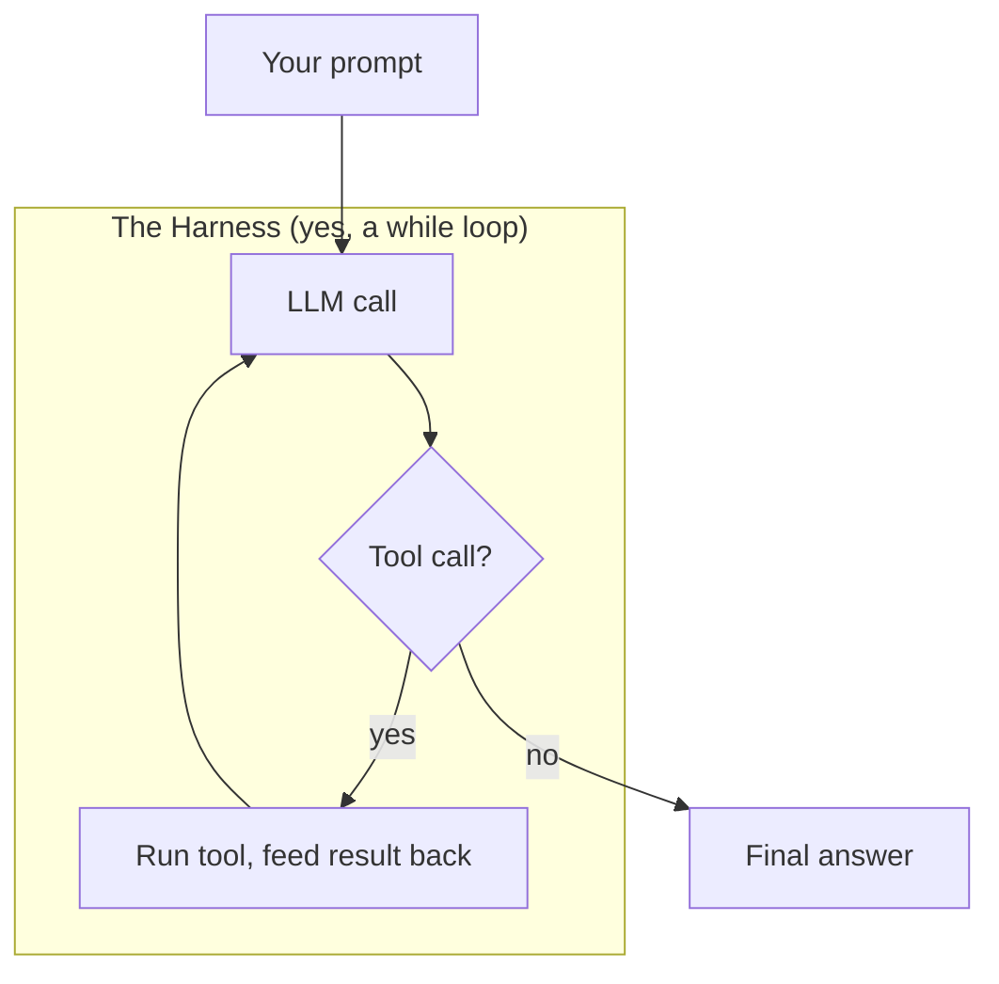

Every week there's a new "AI agent" product. Codex writes your code. Claude Desktop runs your computer. Pi chats from your pocket. OpenClaw routes agents to your group chats. They feel like magic — like the model *thinks*, *plans*, and *acts*.

It doesn't. **The harness does.** The harness is everything we build **around** the model — the loop, the tools, the memory, the guardrails — that turns a text-prediction engine into something that looks like it has intentions. Strip the paint off any of them and you'll find the same thing underneath: a while loop.

---

## So what does it actually do?

A harness has four moving parts. Every agent product you've heard of is some combination of these, dressed up differently.

- **The loop** — ask the model a question, check if it wants to use a tool, run the tool, feed the result back, repeat until it says it's done. OpenAI's Codex does exactly this: it reads your repo, writes code, runs your tests, reads the failures, writes more code, and loops until the tests go green. That's the whole trick.

- **Tool calling** — you hand the model a menu (a JSON schema listing what tools exist and what arguments they take). The model picks items off the menu; your code executes them. Claude Desktop picks from file reads, web searches, and bash commands. Same menu pattern, different restaurant.

- **Memory and context** — conversation history, retrieved documents, a scratchpad for the model's working notes — everything gets stuffed into the prompt each time around the loop. Pi remembers your name and preferences across sessions. Same filing-cabinet idea; different label on the drawer.

- **Guardrails and stop conditions** — max iteration limits, token budgets, content filters, "are we done yet?" checks. OpenClaw uses `allowFrom` lists and mention rules to control who can even trigger the loop. Without guardrails, the loop runs forever — or until your wallet's empty.

That's it. Loop, tools, memory, guardrails. Everything else is UI and marketing.

---

## Wait — this sounds familiar

None of this is new. The shape has been around for decades.

**Game loops** — read player input, update world state, render the frame, repeat. Every video game since Pong runs on this. An agent harness is a game loop where the "player" is an API call and the "world" is your codebase.

**OODA loops** — observe, orient, decide, act. Military strategist John Boyd described this in the 1960s as the cycle that wins dogfights. Replace "observe" with "read the context window" and "act" with "call a tool," and you've got an agent harness.

**REPLs** — read, eval, print, loop. If you've ever typed into a Python shell, you've used one. An agent harness is a REPL where the "eval" step is an LLM inference call.

The industry even walked here in stages. First we had **Prompt Engineering** — craft the perfect single question. Then **Context Engineering** — stuff the right documents into the prompt window via RAG so the model has something to work with. Now people are calling it **Harness Engineering** — building the entire system of loops, tools, and checks *around* the model. The pattern just kept zooming out: from one message, to the context window, to the whole machine.

Headline: **an "agent" is an API call in a loop.** The industry added a glossary and a billing page.

---

## The weird little cousin: the Ralph Wiggum Loop

If you need proof this is literally a while loop, here it is.

In mid-2025, developer Geoffrey Huntley published a post called "Ralph Wiggum as a software engineer." The core idea was a one-liner:

```bash
while :; do cat PROMPT.md | claude; done
```

That's it. Wrap Claude Code in a bash `while true` loop. Pipe in a prompt file. When one session finishes, another starts immediately — reads the same codebase, the same instructions, picks up where the last one left off through files on disk. A Y Combinator hackathon team used this and shipped **six repositories overnight**.

Huntley named it after Ralph Wiggum from *The Simpsons* — the kid who keeps going despite every setback. His description: Ralph builds playgrounds, but he comes home bruised because he fell off the slide. So you tune Ralph by adding a sign next to the slide: "SLIDE DOWN, DON'T JUMP, LOOK AROUND." Eventually Ralph reads the signs and stops falling. **The signs are the harness.**

It got popular enough that Anthropic formalized it into an official Claude Code plugin. The plugin version adds stop hooks, iteration limits, and a `<promise>` tag mechanism — Claude has to explicitly declare "I'm done" before the loop lets it exit. Nicer guardrails, structured state tracking, budget controls. But underneath? Same while loop.

Huntley's take: software becomes **clay on a pottery wheel**. If something isn't right, throw it back on the wheel. The fanciest agent products in the world are doing exactly this — just with better guardrails and a subscription page.

---

## The catch (for real)

**Loops cost money.** Every iteration is an API call. A 50-iteration Ralph Wiggum run on a complex codebase can cost $50–100+ in token usage. The iteration cap isn't just a safety net — it's a budget control.

**Non-deterministic.** Same prompt, different execution path every single run. Debugging an agent failure is archaeology — you're sifting through a trail of tool calls trying to figure out where it went sideways, and you can't reproduce it reliably.

**Latency stacks.** Each loop iteration adds seconds. Ten tool calls means ten round trips to the API before you see a final answer. Users wait.

**The context window fills up.** The Ralph Wiggum community discovered this tension early: the original bash loop gives each iteration a *fresh* context window (clean slate, but expensive — the model re-reads everything). The plugin version keeps one session alive and accumulates conversation history (cheaper, but the model carries baggage from every failed attempt). Neither is clearly better. It depends on the task.

This is also why the sharpest teams practice **"harness-first" engineering** — build the automated tests, linters, and observability *before* you let the agent loose. The agent generates; the harness verifies. You don't read every line of output; your checks do.

---

## Why did it take this long?

Two things had to happen.

First, **models learned to emit structured tool calls.** Before JSON mode and function-calling APIs, harnesses were regex-parsing the model's freeform text output and praying it matched a pattern. One stray comma and the loop crashed. Once models could reliably fill in a JSON schema on command, the loop became trustworthy enough to ship real products around.

Second, **the methodology caught up.** We went from optimizing single prompts, to engineering entire context windows, to building full systems of loops and checks around the model — because each generation of model got more capable *and* more unpredictable. The scaffolding had to grow with the thing it was scaffolding.

---

## Sketch of the idea

If you're a diagrams person, here's the whole pattern in one glance: a prompt goes in, the model runs in a loop until it's done calling tools, and a final answer comes out. Every agent product you've used is a dressed-up version of this.



---

## Bottom line

**Lean in** if you're building agents — understand the loop before you pick a framework. The harness IS the product; the model inside it is replaceable.

**Proceed with eyes open** if you already use Codex, Claude Desktop, or similar — your costs, latency, and debuggability all live in this loop. Know what you're paying for.

**Nod and smile** if you just call an API once and get one answer back — you don't need a harness yet; you need a function call.

---

**Resources:**

- [Ralph Wiggum as a "software engineer" — Geoffrey Huntley](https://ghuntley.com/ralph/)
- [Everything is a Ralph Loop — Geoffrey Huntley](https://ghuntley.com/loop/)
- [Building Effective Agents — Anthropic](https://www.anthropic.com/research/building-effective-agents)
- [Function Calling — OpenAI Docs](https://platform.openai.com/docs/guides/function-calling)
- [OpenClaw — Self-hosted AI Agent Gateway](https://docs.openclaw.ai/)
