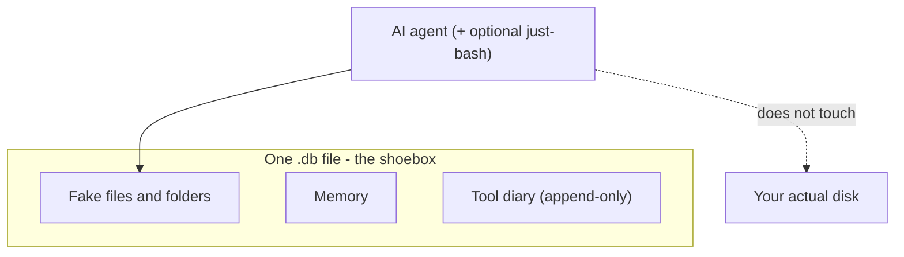

Your AI helper needs files, notes, and memory — and a lot of teams still stitch that together with temp folders, random databases, and log dumps. **AgentFS** (from Turso) puts it all in **one** portable file: pretend folders, scratchpad data, and a diary of what the agent did. Copy it, query it, attach it to a bug report.

The fun part? None of this is a new *idea*. It's old tricks, finally aimed at chatbots.

---

## So what does it actually do?

AgentFS is basically **one shoebox** — a single file using **SQLite**, which is just a standard, lightweight way to stash structured data.

Inside:

- **Fake files and folders** — the agent reads and writes paths like normal software, but nothing touches your real disk. Think index cards: label on top, contents underneath, all in that file.
- **Memory** — session state and context live there too, as simple key–value pairs.
- **A diary of tool use** — each tool call is logged in order (inputs and outputs). Old pages don't get erased; you only add new ones.

You end up with **one `.db` file**. Query it, duplicate it, hand it to someone who needs to know what *actually* happened in that run.

---

## Wait — this sounds familiar

Turso didn't invent the ingredients. They pointed proven patterns at agents.

**The diary** is the headliner: you don't only save the final answer — you save **how you got there**, step by step. Break something? Replay the story. People call that **event sourcing** in enterprise-land; AgentFS calls it a toolcall trail. Same idea.

**The fake file tree** mirrors how computers already think about nested files and folders — only the data lives **inside** the database file instead of on your drive. Familiar shape, different drawer.

**Risky experiments** can branch off a copy so the original stays safe. Storage people call that **copy-on-write**; you can also think **video-game save point**, or (if you know Git) **immutable checkpoints** — AgentFS does that for *live* agent state.

Headline: **boring, battle-tested pieces, wired for agent workloads.** In a hype-heavy field, that's a feature.

---

## The weird little cousin: just-bash

Agents love acting like they're in a terminal. [just-bash](https://turso.tech/blog/agentfs-just-bash) is a **small fake shell** (built in TypeScript) so commands like "show me this file" read from **AgentFS's shoebox**, not your laptop — like a movie set: the door opens, but there's no house behind it.

Handy when you want shell-ish behavior in tight environments (e.g. edge/serverless) without handing the bot your real disk. Trade-off: it's **not** full bash — common commands yes, wild one-liners maybe not.

---

## The catch (for real)

**One writer at a time** — one busy file, one line at the counter. Lots of agents writing together to the same state gets awkward fast. Turso sketches bigger designs for later; treat those as forward-looking, not today's guarantee.

**Lots of tiny file edits** can add up on disk. If your bottleneck is the AI API, you won't care. If you're processing huge files constantly, keep it in mind.

**It's beta.**

---

## Why did it take this long?

Agents shipped with state everywhere — scraps in temp folders, scraps in databases, scraps in logs — before "one coherent shoebox" got productized. Model news is loud; **audit trails and filing cabinets sound dull.** AgentFS is someone finally saying: **let's use boring stuff that already survived production.**

---

## Sketch of the idea

If you're a diagrams person, here's the whole thing in one glance: the agent talks to **one file** that holds the pretend filesystem, the scratchpad, and the diary. Your real drive sits off to the side.

---

## Bottom line

**Lean in** if you're building agents and your state story is mostly hope and grep.

**Proceed with eyes open** if you need lots of parallel writers or massive file processing — know the limits first.

**Nod and smile** if you're not touching agents; this week's rabbit hole wasn't for you.

---

**Resources:**

- [AgentFS Introduction — Turso Docs](https://docs.turso.tech/agentfs/introduction)
- [The Missing Abstraction for AI Agents — Turso Blog](https://turso.tech/blog/agentfs)
- [Building AI Agents with just-bash — Turso Blog](https://turso.tech/blog/agentfs-just-bash)
- [Mounting AgentFS like a normal folder on your machine — Turso Blog](https://turso.tech/blog/agentfs-fuse)
- [AgentFS on GitHub](https://github.com/tursodatabase/agentfs)
- [Towards a Disaggregated Agent Filesystem on Object Storage](https://penberg.org/blog/disaggregated-agentfs.html)
