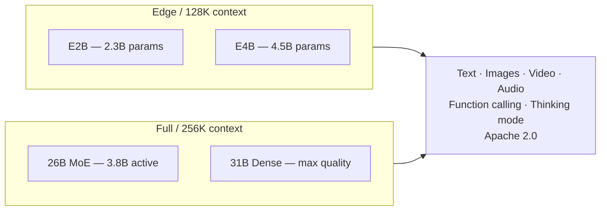

Google dropped **Gemma 4** — four open models ranging from a tiny edge-friendly chip to a full-size reasoning beast. The headline: math went from 20% to 89%, it understands images, video, and audio natively, and the whole family ships under a clean Apache 2.0 license. No gotcha clauses.

The fun part? A lot of the tricks are borrowed from much bigger, closed models — finally landing in something you can actually run yourself.

---

## So what is it, exactly?

Gemma 4 is a **family of four models** — pick your size based on what you're building and what hardware you have:

- **E2B / E4B** — 2–4.5B parameters, 128K context, designed to run on a phone or a Raspberry Pi
- **26B MoE** — 26B total but only 3.8B active at once (like only waking up the parts you need), 256K context
- **31B Dense** — the full-quality option, 256K context, ranked #3 on open-model leaderboards

All four are **multimodal**: they understand text, images (at variable resolutions), video clips, and audio. Not as bolt-ons — baked in from the start. All four also support **native function calling**, so they can actually use tools instead of just talking about them.

---

## Wait — didn't Gemma 3 just come out?

Kind of. But the jump here is real.

**Math** is the starkest example: Gemma 3 scored around 20% on competition-math benchmarks. Gemma 4 scores 89%. That's not iteration — that's a different model with **reasoning/thinking modes** that let it spend more tokens working through a problem before answering.

**Vision** also got a proper upgrade. The old image handling was mostly "here's a picture, describe it." The new one handles variable aspect ratios, configurable resolution budgets, and can follow what's happening across frames in a video.

**Context** got longer too — up to 256K tokens for the bigger models. That's roughly 500 pages of text you can feed it at once.

---

## The weird part: it runs on the edge

The two small models (E2B and E4B) are built around something called **Per-Layer Embeddings** — an architecture trick that packs more capability into fewer parameters. The upshot: competitive performance from something that runs completely offline on a consumer GPU, an NVIDIA Jetson, or a Raspberry Pi.

Zero latency. No API call. No cloud dependency. That's genuinely useful for anything that needs to work offline or can't send data out — on-device apps, local agents, air-gapped environments.

---

## The catch

**The small models cap out at 128K context** — still large, but half the bigger models. If you need to chew through long documents, you want the 26B or 31B.

**"Thinking mode" costs tokens.** The reasoning chains can run 4,000+ tokens before the model even starts answering. On edge hardware, that adds up fast.

**MoE models are weird to host.** The 26B MoE only *uses* 3.8B parameters per forward pass, but you still need to load all 26B into memory. Great for latency; not great if RAM is tight.

**It's still April.** Leaderboard scores are a snapshot. Real-world gaps between Gemma 4 and closed frontier models (GPT-4o, Gemini Ultra) will only become clear once people actually ship things with it.

---

## Why does the license matter?

Most "open" AI models have footnotes. Gemma 4 ships under **Apache 2.0** with no extra carve-outs — no commercial deployment restrictions, no redistribution limits, no "you must not use this to compete with Google" fine print.

That's rarer than it should be. For teams that need to actually ship a product (not just demo one), the license is often the whole conversation.

---

## Sketch of the family

---

## Bottom line

**Lean in** if you're building something that needs an open, multimodal model with real reasoning — especially if you care about the license.

**Proceed with eyes open** if you're running on edge hardware and need thinking mode — the token cost is real, test before you commit.

**Nod and smile** if you're not in the model business; the main takeaway is that open models are getting genuinely good, genuinely fast.

---

**Resources:**

- [Gemma 4 announcement — Google Blog](https://blog.google/innovation-and-ai/technology/developers-tools/gemma-4/)
- [Gemma 4 model card — Google AI Dev](https://ai.google.dev/gemma/docs/core/model_card_4)
- [Welcome Gemma 4 — Hugging Face Blog](https://huggingface.co/blog/gemma4)
- [Gemma 4 on Hugging Face](https://huggingface.co/collections/google/gemma-4-release)
